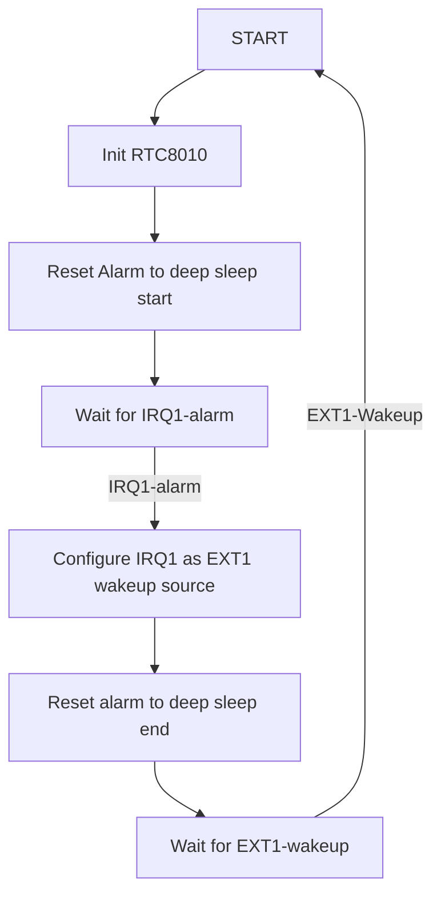

###BLE  Assigned Numbers

Each official manufacturer has a assigned number of its bluetooth device. The list can be found here:

https://www.bluetooth.com/wp-content/uploads/Files/Specification/HTML/Assigned_Numbers/out/en/Assigned_Numbers.pdf

The SwitchBot Bot is made by "Woan Technology (Shenzhen) Co., Ltd." and has the assigned number `0x0969` in its ble advertising data.

## Deep Sleep Procedure

The device uses a start time and an end time for a deep sleep period per day. The start and end hour is hardocded in [./main/switchbot_over_web.cpp](switchbot_over_web.cpp). The deep sleep can use the internal rtc of the ESP32 or an external RTC8010 module. The external rtc is usually more precise than the internal one. First empirical evaluation of the internal rtc showed that it has a time shift of one to two hours after waking up from deep sleep.

### RTC8010

With the RTC8010 module the deep sleep procedure defines an alarm interrupt which gets triggered when the deep sleep shall start. In this interrupt procedure, the deep sleep gets configured:

* Configure RTC8010-IRQ1 as EXT1 wakeup source and enable pullups as no external pullup exists.
* Reset the RTC8010 alarm with the deep sleep end cron config.
* After wakeup, the main init resets the alarm interrupt to the deep sleep start time.

